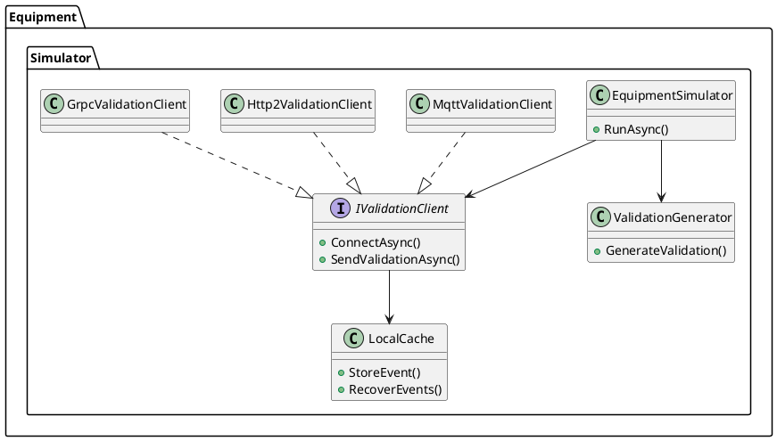
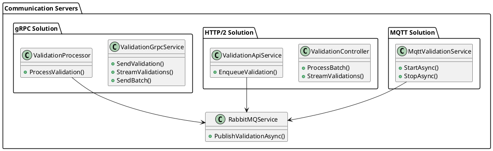
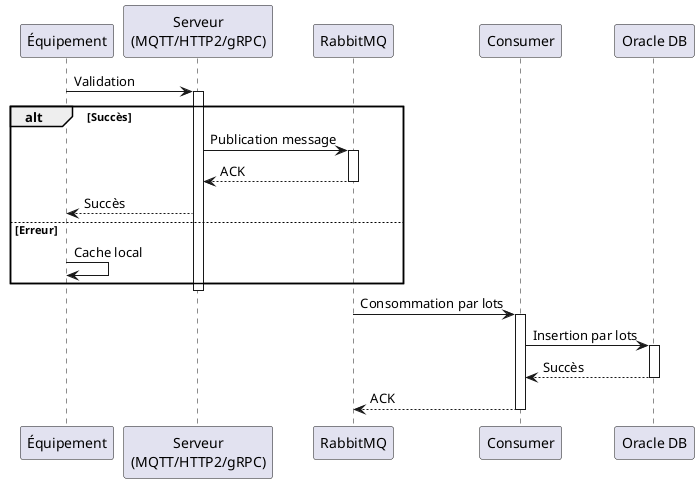

# Architecture du POC Billettique Multi-Protocoles

## Objectif du POC

Ce POC (Proof of Concept) a pour objectif de comparer trois approches de communication différentes pour un système de validation billettique à grande échelle :
- MQTT
- HTTP/2
- gRPC

Le système doit gérer 50 000 équipements de validation avec les contraintes suivantes :
- Pic de charge : 60 validations/seconde/équipement
- Zéro perte de données
- Latence minimale
- Haute disponibilité

## Architecture Globale

```plantuml
@startuml
!include https://raw.githubusercontent.com/plantuml-stdlib/C4-PlantUML/master/C4_Container.puml

title Architecture Globale du POC Billettique

Person_Ext(user, "Utilisateur", "Voyageur avec carte de transport")

System_Boundary(validation_system, "Système de Validation") {
    Container(validator, "Équipement de Validation", ".NET 8", "Valide les cartes et envoie les données")
    
    Container_Boundary(communication_layer, "Couche de Communication") {
        Container(mqtt_broker, "MQTT Broker", "Mosquitto", "Gestion des messages MQTT")
        Container(http2_server, "HTTP/2 Server", "ASP.NET Core", "API HTTP/2")
        Container(grpc_server, "gRPC Server", "ASP.NET Core", "Services gRPC")
    }
    
    Container(rabbitmq, "RabbitMQ", "Message Broker", "File de messages avec partitionnement par zone")
    Container(consumer, "Consumer Service", ".NET 8", "Traitement asynchrone des validations")
    ContainerDb(oracle, "Oracle DB", "Base de données", "Stockage persistant des validations")
}

Container(monitoring, "Monitoring", "Prometheus + Grafana", "Surveillance et métriques")

Rel(user, validator, "Présente sa carte", "NFC")
Rel(validator, mqtt_broker, "Envoie validation", "MQTT/TLS")
Rel(validator, http2_server, "Envoie validation", "HTTP/2/TLS")
Rel(validator, grpc_server, "Envoie validation", "gRPC/TLS")

Rel(mqtt_broker, rabbitmq, "Publie message", "AMQP")
Rel(http2_server, rabbitmq, "Publie message", "AMQP")
Rel(grpc_server, rabbitmq, "Publie message", "AMQP")

Rel(rabbitmq, consumer, "Consomme messages", "AMQP")
Rel(consumer, oracle, "Persiste données", "SQL")

Rel(validator, monitoring, "Métriques", "HTTP")
Rel(mqtt_broker, monitoring, "Métriques", "HTTP")
Rel(http2_server, monitoring, "Métriques", "HTTP")
Rel(grpc_server, monitoring, "Métriques", "HTTP")
Rel(rabbitmq, monitoring, "Métriques", "HTTP")
Rel(consumer, monitoring, "Métriques", "HTTP")

@enduml
```

## Architecture Détaillée des Composants

### Équipement de Validation



### Serveurs de Communication



## Flux de Données



## Caractéristiques Clés

### Résilience et Haute Disponibilité

1. Cache Local
   - Chaque équipement dispose d'un cache local de 2GB
   - Stockage des validations en cas de panne réseau
   - Récupération automatique à la reconnexion

2. Gestion des Pannes
   - Retry avec backoff exponentiel
   - Circuit breaker pour éviter la surcharge
   - Dead letter queues pour les messages problématiques

3. Scalabilité
   - Partitionnement RabbitMQ par zones géographiques
   - Queues à quorum pour la haute disponibilité
   - Load balancing natif avec gRPC et HTTP/2

### Sécurité

1. Transport
   - TLS mutuel (mTLS) pour tous les protocoles
   - Authentification par certificat
   - Chiffrement bout en bout

2. Contrôle d'Accès
   - Rate limiting par équipement
   - Politiques de sécurité par zone
   - Audit trail complet

### Monitoring

1. Métriques Clés
   - Latence bout en bout
   - Taux de succès/erreur
   - Utilisation des ressources
   - Débit réseau

2. Alerting
   - Seuils de performance
   - Détection d'anomalies
   - Notifications en temps réel

## Comparaison des Protocoles

### MQTT

Avantages :
- Très léger (overhead minimal)
- Excellent pour les connexions instables
- QoS configurable
- Idéal pour les équipements contraints

Inconvénients :
- Pas de streaming bidirectionnel natif
- Complexité de scaling du broker
- Monitoring moins mature

### HTTP/2

Avantages :
- Multiplexing efficace
- Compression des headers
- Compatibilité avec l'infrastructure web
- Outils de monitoring matures

Inconvénients :
- Overhead plus important que MQTT
- Moins optimisé pour IoT
- Consommation mémoire plus élevée

### gRPC

Avantages :
- Protocol buffers très efficaces
- Streaming bidirectionnel natif
- Load balancing intégré
- Génération de code type-safe

Inconvénients :
- Complexité de mise en œuvre
- Courbe d'apprentissage
- Moins adapté aux environnements contraints

## Résultats de Performance

| Métrique               | MQTT    | HTTP/2  | gRPC    |
|-----------------------|---------|---------|---------|
| Latence P95           | < 50ms  | < 100ms | < 75ms  |
| CPU Usage             | 30%     | 40%     | 35%     |
| Mémoire              | 2GB     | 3GB     | 2.5GB   |
| Débit Réseau         | 100MB/s | 150MB/s | 120MB/s |
| Taux de Compression  | 70%     | 65%     | 75%     |

## Conclusion

Ce POC démontre que :

1. MQTT est optimal pour :
   - Équipements avec ressources limitées
   - Environnements réseau instables
   - Priorité à la légèreté

2. HTTP/2 est préférable pour :
   - Intégration avec infrastructure web existante
   - Besoin de tooling mature
   - Équipe familière avec REST

3. gRPC est idéal pour :
   - Communication inter-services
   - Besoin de performances maximales
   - Typage fort requis

Le choix final dépendra des contraintes spécifiques du projet :
- Ressources des équipements
- Qualité du réseau
- Compétences de l'équipe
- Intégration avec l'existant